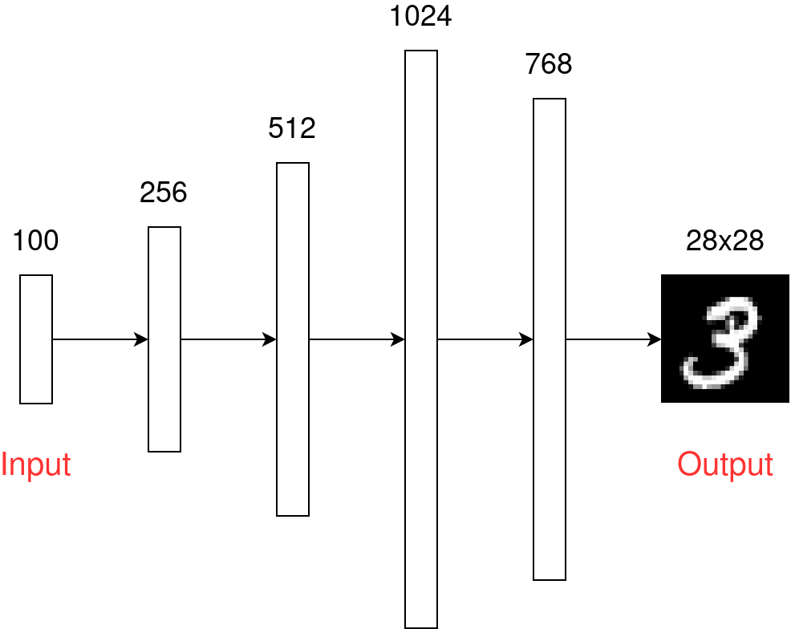
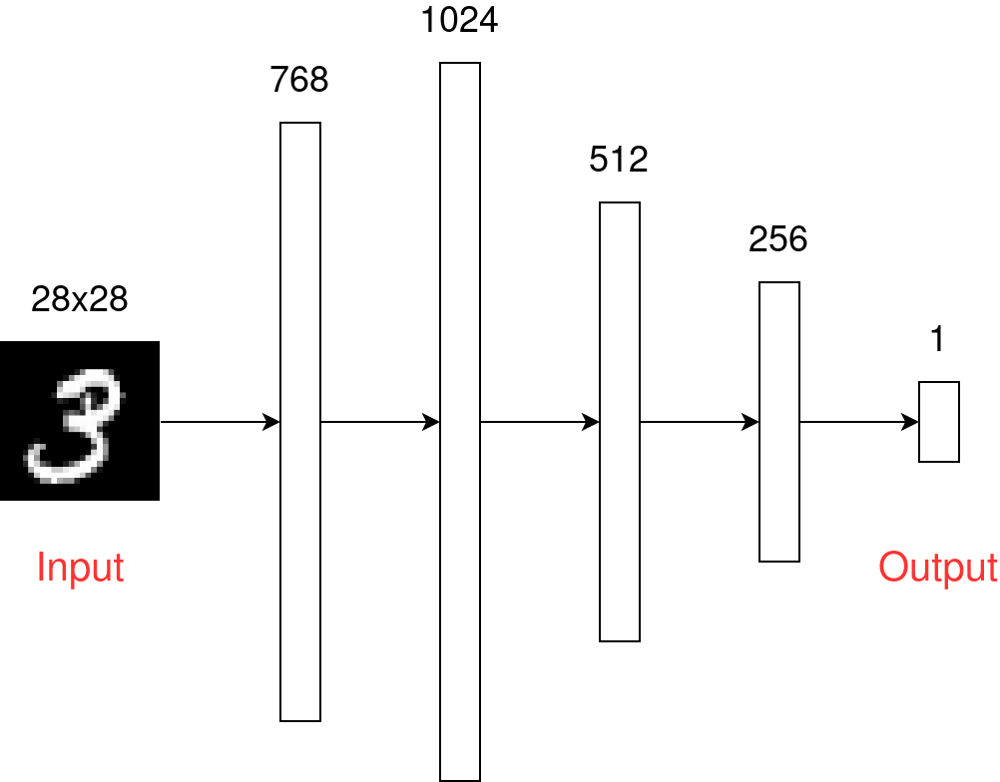
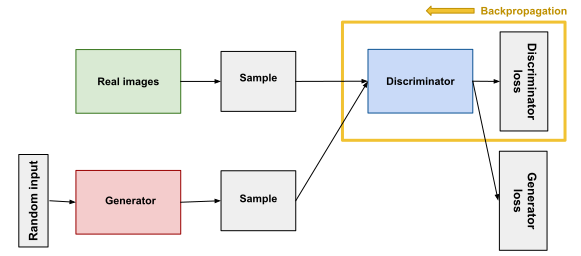

# Giới thiệu về GAN

## GAN là gì?

Được đánh giá là ý tưởng thú vị nhất thập kỷ trong lĩnh vực Machine Learning (học máy), GAN đã giành được những thành công vang dội kể từ khi ra mắt vào năm 2014 ([paper](https://arxiv.org/abs/1406.2661)) bởi [Ian Goodfellow](https://en.wikipedia.org/wiki/Ian_Goodfellow) và đồng nghiệp. Vậy GAN là gì?

**GAN** viết tắt của `Generative Adversarial Network` (_xin phép không dịch ra tiếng Việt_), thuộc nhóm các mô hình _generative_, có nghĩa là có khả năng sinh ra dữ liệu mới.


Những hình ảnh người ở trên hoàn toàn không có thật mà được tạo ra từ mạng [StyleGAN2](https://github.com/NVlabs/stylegan2) - một kiến trúc mạng GAN do NVIDIA phát triển.

Từ `Adversarial` trong GAN có nghĩa là đối nghịch do GAN có cấu trúc gồm 2 mạng có nhiệm vụ trái ngược với nhau. Chi tiết hơn về cấu trúc GAN sẽ được trình bày ở phần dưới đây:

## Cấu trúc của GAN

GAN có 2 phần:

- **Generator**: Cố gắng tạo ra dữ liệu giống như dữ liệu trong dataset.
- **Discriminator**: Cố gắng phân biệt dữ liệu do bộ **Generator** tạo ra và dữ liệu trong dataset


> Ảnh được lấy từ [Working Principles of Generative Adversarial Networks (GANs)](https://dzone.com/articles/working-principles-of-generative-adversarial-netwo)

Bộ **Generator** và **Discriminator** giống như kẻ làm tiền giả và cảnh sát vậy. Kẻ làm tiền giả luôn cố gắng làm tiền giả giống thật nhất có thể còn cảnh sát thì có nhiệm vụ phân biệt tiền giả và tiền thật.

Ban đầu, kẻ làm tiền giả còn ít kinh nghiệm, đã tạo ra những đồng tiền giả quá dễ phân biệt, khiến cho cảnh sát nhanh chóng biết được đó là tiền giả:


Sau nhiều lần thất bại, kẻ làm tiền giả càng ngày càng tạo ra tiền giả giống thật hơn:


Cuối cùng, nếu kẻ làm tiền giả vẫn chưa bị bắt, hắn sẽ tạo ra những đồng tiền giả rất giống thật, đủ để qua mặt cảnh sát, khiến cho cảnh sát không thế phân biệt được đâu là tiền thật, đâu là tiền giả nữa:


> Hình ảnh và ví dụ lấy từ [Overview of GAN Structure](https://developers.google.com/machine-learning/gan/gan_structure)

Kiến trúc của GAN được mô tả tổng quát như sau:


Hai bộ **Generator** và **Discriminator** giống như tham gia một trò chơi đối kháng, khi mà một bên giành được lợi thế thì tương ứng bên kia bị bất lợi. Trong [lý thuyết trò chơi](https://vi.wikipedia.org/wiki/L%C3%BD_thuy%E1%BA%BFt_tr%C3%B2_ch%C6%A1i), tình huống này được gọi là [trò chơi có tổng bằng không](https://vi.wikipedia.org/wiki/Tr%C3%B2_ch%C6%A1i_c%C3%B3_t%E1%BB%95ng_b%E1%BA%B1ng_kh%C3%B4ng). Bạn này hướng thú có thể đọc để tìm hiểu thêm.

Phần tiếp theo sẽ là đi sâu vào chi tiết các thành phần và cách huấn luyện GAN. Để trực quan và dễ hiểu, mình sẽ lấy ví dụ bài toán xây dựng GAN để tạo ra chữ số viết tay giả, sử dụng bộ dataset quen thuộc [MNIST](http://yann.lecun.com/exdb/mnist). Toàn bộ phần code mình sẽ sử dụng pytorch.

## Bộ Generator

Như đã nói ở [phần trên](#cấu-trúc-của-gan), bộ **Generator** sẽ có:

- Đầu vào là một vector
- Đầu ra là một ảnh

Kiến trúc của bộ **Generator** có thể sử dụng bất cứ kiến trúc mạng neural nào. Mình sẽ bắt đầu với kiến trúc neural network kiểu sequence như sau:



Input của mạng neural này mình chọn là một vector 100 chiều. Vector này sẽ được sinh random từ [normal distribution](https://en.wikipedia.org/wiki/Normal_distribution) hoặc [uniform distribution](https://en.wikipedia.org/wiki/Continuous_uniform_distribution). Trong pytorch, mình sinh ra input vector bằng dòng code sau:

```python
z = torch.FloatTensor(np.random.normal(0, 1, (latent_dim,)))
```

Sau đó, input vector sẽ được đi qua lần lượt các lớp ẩn (hidden layer) có kích thước 256, 512, 1024 và kết thúc ở lớp có kích thước 768. Kích thước các lớp ẩn có thể được chọn tuỳ ý, tuy nhiên kích thước lớp cuối cùng cần phải là 768 để có thể reshape về ảnh có kích thước 28x28 (kích thước ảnh trong bộ dataset MNIST)

Bạn có thể tham khảo toàn bộ code của khối Generator:

```python
class Generator(nn.Module):
    def __init__(self):
        super(Generator, self).__init__()

        self.model = nn.Sequential(
            nn.Linear(latent_dim, 256),
            nn.LeakyReLU(0.2, inplace=True),
            nn.Linear(256, 512),
            nn.LeakyReLU(0.2, inplace=True),
            nn.Linear(512, 1024),
            nn.LeakyReLU(0.2, inplace=True),
            nn.Linear(1024, 768),
            nn.Sigmoid()
        )

    def forward(self, z):
        img = self.model(z)
        img = img.view(img.size(0), 28, 28)
        return img
```

Dòng `img = img.view(img.size(0), 28, 28)` dùng để resize vector đầu ra, từ vector 1x768 thành matrix 28x28

## Bộ Discriminator

Như đã giới thiệu ở các phần trên, bộ Discriminator có nhiệm vụ phân biệt đâu là ảnh chữ viết tay thật, đâu là ảnh được bộ Generator tạo ra. Vì vậy, bộ Discriminator có:

- Đầu vào là một ảnh
- Đầu ra là giá trị phân loại ảnh là thật hay giả

Đây chính là bài toán phân loại ảnh thường thấy, cụ thể là [binary classification](https://en.wikipedia.org/wiki/Binary_classification). Mình cũng xây dựng bộ Discriminator một cách đơn giản như sau:



Đầu vào của mạng là một ảnh có kích thước 28x28 và được resize về một vector 768 chiều. Tiếp theo mạng có các lớp ẩn với kích thước lần lượt 1024, 512, 256. Và cuối cùng, lớp output là vector có một chiều, đại diện cho xác suất ảnh đầu vào là ảnh thật.

Dưới đây là code bộ Discriminator mình đã triển khai trong pytorch:

```python
class Discriminator(nn.Module):
    def __init__(self):
        super(Discriminator, self).__init__()

        self.model = nn.Sequential(
            nn.Linear(768, 1024),
            nn.LeakyReLU(0.2, inplace=True),
            nn.Dropout(0.3),
            nn.Linear(1024, 512),
            nn.LeakyReLU(0.2, inplace=True),
            nn.Dropout(0.3),
            nn.Linear(512, 256),
            nn.LeakyReLU(0.2, inplace=True),
            nn.Dropout(0.3),
            nn.Linear(256, 1),
            nn.Sigmoid(),
        )

    def forward(self, img):
        img_flat = img.view(img.size(0), -1)
        output = self.model(img_flat)

        return output
```

Dòng `img_flat = img.view(img.size(0), -1)` dùng để "duỗi thẳng" ảnh đầu vào thành một vector, làm đầu vào cho mạng. `img.size(0)` ở đây chính là `batch size`

## Huấn luyện GAN

Vậy làm thế nào để huấn luyện GAN? Hàm mất mát (loss function) của GAN nên chọn như thế nào? Lan truyền ngược (backpropagation) được thực hiện như thế nào?

Với GAN, chúng ta sẽ tiến hành huấn luyện 2 khối Discriminator và Generator lần lượt chứ không thực hiện huấn luyện cùng lúc.

### Huấn luyện khối Discriminator

Như đã nói ở trên, bài toán của khối Discriminator là bài toán phân loại ảnh thông thường. Vì vậy với khối Discriminator ta có thể sử dụng hàm mất mát là hàm [cross-entropy](https://en.wikipedia.org/wiki/Cross_entropy) và thực thực lan truyền ngược:



> Hình ảnh lấy từ [Overview of GAN Structure](https://developers.google.com/machine-learning/gan/gan_structure)

Đầu vào training cho khối Discriminator là ảnh thật lấy từ bộ dataset với nhãn được gán là 1, ảnh tạo ra từ bộ Generator với nhãn được gán là 0:

```python
bce_loss = torch.nn.BCELoss()
valid = Variable(Tensor(batch_size, 1).fill_(1.0), requires_grad=False)
fake = Variable(Tensor(batch_size, 1).fill_(0.0), requires_grad=False)

# Sample noise as generator input
z = Variable(Tensor(np.random.normal(0, 1, (batch_size, latent_dim))))

# Measure discriminator's ability to classify real from generated samples
real_loss = bce_loss(discriminator(real_imgs), valid)
fake_loss = bce_loss(discriminator(generator(z)), fake)

d_loss = (real_loss + fake_loss) / 2
```

Với đầu vào là `real_imgs`, đầu ra mong muốn sẽ là `valid` - một vector chứ toàn giá trị 1. Ngược lại, với đầu vào là ảnh tạo ra từ khối Generator (`generator(z)`). đầu ra mong muốn lại là `fake` - một vector chứ toàn giá trị 0.

### Huấn luyện khối Generator

Ngược lại với khối Discriminator, mong muốn của khối Generator lại là đánh lừa được khối Discriminator, tức là muốn đầu ra là 1 với các ảnh tạo do nó tạo ra. Mặt khác, nó cũng không quan tâm đến việc các ảnh thật được dự đoán đúng hay sai. Vì vậy, phần training cho bộ Generator chỉ cần như sau:

```python
g_loss = bce_loss(discriminator(generator(z)), valid)
```

Phần nhãn đã được chuyển từ `fake` trong công thức tính loss của Discriminator sang thành `valid`.

Cách tính hàm mất mát như trên được gọi là **Minimax Loss** và đã được giới thiệu trong chính bài [báo gốc của GAN](https://arxiv.org/abs/1406.2661). Theo thời gian, nhiều kiểu tính hàm mất mát khác đã được giới thiệu, có thể kẻ đến như [**Wasserstein loss**](https://arxiv.org/abs/1701.07875) (Hàm loss mặc định của TF-GAN), [**Least Squares GAN Loss**](https://arxiv.org/abs/1611.04076) ... Mọi người có thể tìm đọc thêm để biết xem các hàm mất mát khác thì có lợi gì, được áp dụng trong các trường hợp như thế nào.

## Code và kết quả

Toàn bộ code demo cho bài này được viết tại file [MNIST_GAN.ipynb](MNIST_GAN.ipynb), mọi người có thể xem và chạy thử ở máy của mình hoặc chạy trực tiếp trên [google colab](https://colab.research.google.com/github/GafBof/GANs_torch/blob/master/01.%20Introduction/MNIST_GAN.ipynb). Phần code này mình có tham khảo từ repo [PyTorch-GAN](https://github.com/eriklindernoren/PyTorch-GAN) của [Erik Linder-Norén](https://github.com/eriklindernoren)

Đây là kết quả thu được của bộ Generator sau khi huấn luyện 20 epoch:


Nhìn chung kết quả thu được cũng khá ổn, các ảnh đầu ra trông cũng khá giống với ảnh gốc và có thể nhận biết được trong ảnh là số gì :smile:
